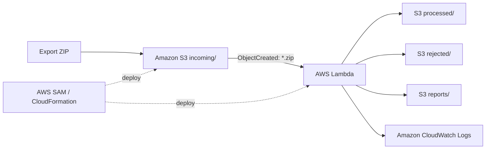

# E-commerce Interactions Pipeline

Pipeline batch dùng để kiểm tra và làm sạch dữ liệu tương tác e-commerce trước khi bàn giao cho phần recommendation/ML. Pipeline tập trung vào `interactions.csv`, dùng `Products.json` để đối chiếu mã sản phẩm và giữ nguyên ID từ hệ thống nguồn.

Project có thể chạy local bằng Python và đã được triển khai trên AWS theo mô hình serverless bằng AWS SAM/CloudFormation.

## Trạng thái hiện tại

| Hạng mục | Trạng thái |
|---|---|
| Chạy local | Đã kiểm tra thành công |
| Automated tests | 48 tests passed |
| AWS deployment | Đã triển khai và kiểm tra tại `ap-southeast-1` |
| S3 event trigger | Hoạt động |
| Lambda processing | Hoạt động |
| CloudWatch Logs | Đã ghi nhận lần chạy thành công |
| Amazon Athena | Có sẵn SQL mẫu, chưa bắt buộc sử dụng |

## Phạm vi xử lý

Pipeline thực hiện các công việc sau:

- đọc `interactions.csv` từ file ZIP;
- đọc trường `id` trong `Products.json` để kiểm tra `ITEM_ID`;
- bỏ qua `items.csv` theo data contract hiện tại;
- kiểm tra dữ liệu thiếu, event không hợp lệ, timestamp không hợp lệ và dòng trùng;
- giữ nguyên `USER_ID` và `ITEM_ID`, không tự tạo lại mã;
- xuất dataset sạch, dataset bị loại và báo cáo chất lượng dữ liệu.

Pipeline không train model và không thay đổi các file đầu vào.

## Input

File ZIP đầu vào có thể chứa nhiều cấp thư mục. Pipeline tìm file theo basename nên không yêu cầu chúng phải nằm trực tiếp ở root của ZIP.

```text
export/
└── export/
    ├── interactions.csv
    ├── items.csv          # ignored
    └── Products.json
```

`interactions.csv` cần có bốn trường logic:

```csv
USER_ID,ITEM_ID,EVENT_TYPE,TIMESTAMP
```

## Kiến trúc AWS



Các thành phần đã sử dụng:

- **AWS SAM / AWS CloudFormation**: khai báo và triển khai hạ tầng;
- **Amazon S3**: lưu file đầu vào và kết quả;
- **AWS Lambda**: xử lý ZIP khi có file mới trong `incoming/`;
- **Amazon CloudWatch Logs**: lưu log và summary của mỗi lần chạy;
- **Amazon Athena**: phần mở rộng tùy chọn để truy vấn CSV bằng SQL.

## Luồng xử lý trên AWS

```text
Upload ZIP vào S3 incoming/
        ↓
S3 tự động kích hoạt Lambda
        ↓
Lambda đọc interactions.csv và Products.json
        ↓
Kiểm tra, chuẩn hóa và tạo báo cáo
        ↓
Ghi kết quả vào processed/, rejected/ và reports/
        ↓
Ghi summary vào CloudWatch Logs
```

## Kết quả kiểm tra với dữ liệu hiện tại

| Metric | Kết quả |
|---|---:|
| Input rows | 23,377 |
| Clean rows | 23,377 |
| Rejected rows | 0 |
| Duplicate rows | 0 |
| Unique users | 200 |
| Unique items | 100 |
| Generated user IDs | 0 |
| Generated item IDs | 0 |
| ID preservation | PASS |
| Test result | 48 passed |

File dùng cho bước train model:

```text
processed/latest/interactions_clean.csv
```

Các file báo cáo:

```text
reports/latest/data_quality_report.json
reports/latest/data_quality_report.md
```

## Cấu trúc project

```text
.
├── app/
│   ├── archive_reader.py
│   ├── pipeline.py
│   ├── reporting.py
│   ├── cli.py
│   └── lambda_handler.py
├── tests/
├── athena/
├── docs/
├── template.yaml
├── requirements-dev.txt
├── pytest.ini
└── README.md
```

## Chạy local

Yêu cầu Python 3.11 trở lên.

```powershell
py -m venv .venv
Set-ExecutionPolicy -Scope Process -ExecutionPolicy Bypass
.\.venv\Scripts\Activate.ps1
python -m pip install --upgrade pip
pip install -r requirements-dev.txt
python -m pytest -q
python -m app.cli --input .\export.zip --output .\output
```

Output local:

```text
output/
├── processed/interactions_clean.csv
├── rejected/interactions_rejected.csv
└── reports/
    ├── data_quality_report.json
    └── data_quality_report.md
```

## Validate, build và deploy AWS

Yêu cầu:

- AWS CLI v2;
- AWS SAM CLI;
- một AWS profile không sử dụng root user;
- Region `ap-southeast-1` hoặc Region do người triển khai lựa chọn.

Kiểm tra danh tính trước khi deploy:

```powershell
aws sts get-caller-identity --profile ecommerce-pipeline
```

Validate và build:

```powershell
sam validate --lint `
  --profile ecommerce-pipeline `
  --region ap-southeast-1

sam build --no-use-container
```

Deploy lần đầu:

```powershell
sam deploy --guided `
  --profile ecommerce-pipeline `
  --region ap-southeast-1
```

Cấu hình đã dùng khi deploy:

```text
Stack name: ecommerce-interactions-pipeline
Region: ap-southeast-1
Confirm changes before deploy: Y
Allow SAM CLI IAM role creation: Y
Disable rollback: N
Save arguments to samconfig.toml: Y
```

Project không yêu cầu Docker cho quy trình build hiện tại.

## Upload dữ liệu và kiểm tra kết quả

Lấy tên bucket từ CloudFormation output:

```powershell
$BUCKET = aws cloudformation describe-stacks `
  --stack-name ecommerce-interactions-pipeline `
  --query "Stacks[0].Outputs[?OutputKey=='DataBucketName'].OutputValue | [0]" `
  --output text `
  --profile ecommerce-pipeline `
  --region ap-southeast-1
```

Upload ZIP:

```powershell
aws s3 cp .\export.zip "s3://$BUCKET/incoming/export.zip" `
  --profile ecommerce-pipeline `
  --region ap-southeast-1
```

Kiểm tra output:

```powershell
aws s3 ls "s3://$BUCKET/" --recursive `
  --profile ecommerce-pipeline `
  --region ap-southeast-1
```

Xem log gần nhất:

```powershell
$FUNCTION = aws cloudformation describe-stacks `
  --stack-name ecommerce-interactions-pipeline `
  --query "Stacks[0].Outputs[?OutputKey=='PipelineFunctionName'].OutputValue | [0]" `
  --output text `
  --profile ecommerce-pipeline `
  --region ap-southeast-1

aws logs tail "/aws/lambda/$FUNCTION" `
  --since 1h `
  --profile ecommerce-pipeline `
  --region ap-southeast-1
```

## Bàn giao cho team ML

Các file cần bàn giao:

```text
interactions_clean.csv
data_quality_report.json
data_quality_report.md
```

Trong đó `interactions_clean.csv` là dataset dùng cho bước tiếp theo của recommendation/ML. `Products.json` chỉ được dùng để đối chiếu mã sản phẩm và không bị chỉnh sửa.

## Bảo mật và chi phí

- Không lưu Access Key, Secret Access Key, mật khẩu hoặc MFA trong repository.
- Không deploy bằng root user.
- S3 Block Public Access được bật.
- Bucket sử dụng mã hóa SSE-S3.
- Lambda chỉ được cấp quyền đọc `incoming/*` và ghi vào các prefix output cần thiết.
- Lambda chỉ chạy khi có file `.zip` mới trong `incoming/`, không chạy liên tục.
- CloudWatch Logs được giữ trong 7 ngày theo template hiện tại.
- Project không tạo EC2, RDS, NAT Gateway, OpenSearch hoặc SageMaker.

## Xóa tài nguyên khi không còn sử dụng

Làm rỗng đúng bucket của stack trước:

```powershell
aws s3 rm "s3://$BUCKET" --recursive `
  --profile ecommerce-pipeline `
  --region ap-southeast-1
```

Sau đó xóa stack:

```powershell
sam delete `
  --stack-name ecommerce-interactions-pipeline `
  --profile ecommerce-pipeline `
  --region ap-southeast-1
```

Thao tác xóa dữ liệu S3 không thể hoàn tác, vì vậy cần kiểm tra đúng bucket trước khi chạy.

## Tài liệu bổ sung

- [Kiến trúc chi tiết](docs/architecture.md)
- [Workshop tiếng Việt](docs/workshop-vi.md)
- [Workshop English](docs/workshop-en.md)
- [Checklist ảnh minh chứng](docs/screenshots-checklist.md)
- [Athena SQL](athena/README.md)
