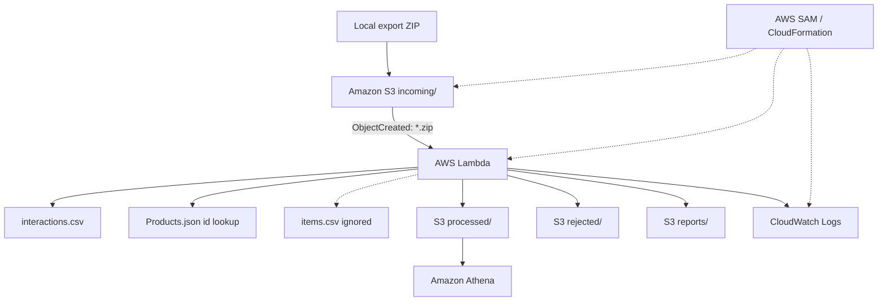

# ecommerce-interactions-pipeline-aws

Batch Data Engineering project xử lý một ZIP export interaction e-commerce,
giữ nguyên ID thật và tạo CSV sạch cho thành viên ML. Project chạy local bằng
Python standard library và triển khai dạng AWS Lambda ZIP package, không cần
Docker.

## Trạng thái xác minh

| Trạng thái | Kết quả |
|---|---|
| Local verified | **Có** — 48 test pass và ZIP thật đã chạy thành công |
| AWS deploy-ready | **Có** — source, SAM template và Athena SQL đã sẵn sàng |
| AWS deployed and verified | **Chưa** — chưa chạy deploy/query trên tài khoản AWS |

## Bài toán và phạm vi

Pipeline cũ từng đổi ID thật như `user-001`, `prod-070` thành `U0001`, `P0042`.
Cách đó làm dataset không còn khớp an toàn với hệ thống nguồn. Pipeline mới:

- chỉ xử lý `interactions.csv`;
- chỉ đọc trường `id` của `Products.json` để xác minh `ITEM_ID`;
- nhận diện nhưng không đọc/xử lý `items.csv` theo data contract;
- không sửa bất kỳ file input nào;
- không tạo mapping, surrogate key, hash, UUID, index hay feature ML;
- không train model và không xây data platform tổng quát.

## Input và data contract

Input là một ZIP có thể chứa nhiều cấp thư mục. File được tìm theo basename,
không giả định vị trí trực tiếp ở root ZIP. ZIP thật hiện tại có:

```text
export/
└── export/
    ├── interactions.csv
    ├── items.csv          # ignored
    └── Products.json
```

`interactions.csv` phải có bốn cột logic. Header được trim và so khớp không
phân biệt hoa/thường; UTF-8 và UTF-8 BOM đều được hỗ trợ. Output luôn có đúng:

```csv
USER_ID,ITEM_ID,EVENT_TYPE,TIMESTAMP
```

`USER_ID` và `ITEM_ID` luôn được đọc như string. Chỉ khoảng trắng thừa ở hai
đầu bị xóa; chữ hoa/thường, dấu gạch nối, số 0 đầu và cấu trúc gốc được giữ.

## Kiến trúc



Local CLI và Lambda gọi cùng `process_archive`; core không import AWS SDK.
Chi tiết data flow, failure flow và security boundary nằm trong
[`docs/architecture.md`](docs/architecture.md).

## Cấu trúc project

```text
.
├── app/
│   ├── __init__.py
│   ├── archive_reader.py
│   ├── pipeline.py
│   ├── reporting.py
│   ├── cli.py
│   └── lambda_handler.py
├── tests/
│   ├── __init__.py
│   ├── test_archive_reader.py
│   ├── test_pipeline.py
│   └── test_lambda_handler.py
├── athena/
│   ├── create_database.sql
│   ├── create_table.sql
│   ├── sample_queries.sql
│   └── README.md
├── docs/
│   ├── architecture.md
│   ├── workshop-vi.md
│   ├── workshop-en.md
│   └── screenshots-checklist.md
├── output/                    # generated locally; gitignored
│   ├── processed/
│   ├── rejected/
│   └── reports/
├── export.zip
├── template.yaml
├── requirements-dev.txt
├── pytest.ini
├── .gitignore
└── README.md
```

## Validation và cleaning

- ZIP phải hợp lệ; không vượt `MAX_ZIP_SIZE_MB`,
  `MAX_UNCOMPRESSED_SIZE_MB`, `MAX_MEMBER_COUNT`.
- Absolute path, Windows drive path và thành phần `..` đều bị chặn. ZIP không
  được extract ra filesystem.
- Phải có đúng một basename `interactions.csv` và một `Products.json`.
- Product ID phải có giá trị và duy nhất; ID trùng làm dừng toàn job.
- `USER_ID`/`ITEM_ID` không được rỗng; `ITEM_ID` phải có trong Products lookup.
- Event hợp lệ: `view`, `add_to_cart`, `remove_from_cart`, `purchase`. Event
  được trim và lowercase; event không rõ nghĩa không được tự sửa.
- Timestamp phải là Unix seconds integer ASCII lớn hơn 0 và đổi được sang UTC.
- Exact duplicate là bốn trường đã normalize giống nhau. Dòng hợp lệ đầu tiên
  được giữ theo thứ tự gốc; bản lặp sau bị loại khỏi clean và ghi vào rejected
  với `DUPLICATE_ROW`.

Rejection reasons chuẩn:

`MISSING_USER_ID`, `MISSING_ITEM_ID`, `UNKNOWN_ITEM_ID`,
`INVALID_EVENT_TYPE`, `MISSING_TIMESTAMP`, `INVALID_TIMESTAMP`,
`DUPLICATE_ROW`. Nhiều lý do trên một dòng được nối bằng `|`.

## Local output và quality report

```text
output/
├── processed/interactions_clean.csv
├── rejected/interactions_rejected.csv
└── reports/
    ├── data_quality_report.json
    └── data_quality_report.md
```

Rejected CSV luôn được tạo, kể cả khi chỉ có header. JSON/Markdown report chứa
source và size, thời gian, status, row/duplicate/unique counts, product lookup,
missing counts, event/rejection distribution, unknown items, timestamp UTC
range, input/output/generated ID counts, ID-preservation checks, ignored files,
output list và stable run ID.

## Idempotency

Local `run_id` là SHA-256 của bytes ZIP. AWS `run_id` là SHA-256 của bucket,
decoded key, version ID (nếu có), ETag và object size. S3 ghi vào:

```text
processed/run_id=<RUN_ID>/interactions_clean.csv
rejected/run_id=<RUN_ID>/interactions_rejected.csv
reports/run_id=<RUN_ID>/data_quality_report.json
reports/run_id=<RUN_ID>/data_quality_report.md
```

Đồng thời, bốn bản tương ứng dưới `latest/` được ghi đè. S3 redelivery cùng
object không tạo vô hạn folder mới.

## Cài đặt và chạy local trên Windows

Yêu cầu Python 3.11+ để phát triển; Lambda production cấu hình Python 3.13.
Trong Windows PowerShell tại project root:

```powershell
py -m venv .venv
Set-ExecutionPolicy -Scope Process -ExecutionPolicy Bypass
.\.venv\Scripts\Activate.ps1
python -m pip install --upgrade pip
pip install -r requirements-dev.txt
pytest -q
python -m app.cli --input .\export.zip --output .\output
```

Nếu máy không có Windows launcher `py`, dùng `python -m venv .venv`. Với một
số bản Python Unix/MSYS trên Windows, executable nằm ở `.venv\bin\python.exe`
thay vì `.venv\Scripts\python.exe`.

Tên ZIP có dấu ngoặc được hỗ trợ:

```powershell
python -m app.cli --input ".\export(1).zip" --output .\output
```

CLI trả exit code 0 khi thành công và khác 0 khi lỗi. Nó chỉ in summary, không
in dataset hoặc Products lookup.

## Kết quả local với ZIP thật

Đã chạy bằng code, không chỉ kiểm tra bằng mắt:

| Metric | Kết quả |
|---|---:|
| Archive size | 155,323 bytes |
| Total uncompressed | 939,597 bytes |
| Input rows | 23,377 |
| Clean rows | 23,377 |
| Rejected rows | 0 |
| Duplicate rows | 0 |
| Unique users | 200 |
| Unique items | 100 |
| Products lookup | 100 |
| Generated user/item IDs | 0 / 0 |
| ID preservation | PASS |
| Test result | 48 passed |

Event distribution: `view=17089`, `add_to_cart=4382`, `purchase=1220`,
`remove_from_cart=686`. Timestamp range: `1779328787`–`1784505524`, tức
`2026-05-21T01:59:47Z`–`2026-07-19T23:58:44Z`.

## Cài AWS CLI và AWS SAM CLI

1. Cài AWS CLI v2 bằng Windows MSI theo
   [tài liệu cài AWS CLI chính thức](https://docs.aws.amazon.com/cli/latest/userguide/getting-started-install.html).
2. Cài AWS SAM CLI bằng Windows installer theo
   [tài liệu cài SAM CLI chính thức](https://docs.aws.amazon.com/serverless-application-model/latest/developerguide/install-sam-cli.html).
3. Mở PowerShell mới và kiểm tra:

```powershell
aws --version
sam --version
py --version
```

Project không dùng `sam local invoke` như bước bắt buộc. Docker không bắt buộc;
build chính là `sam build --no-use-container`.

## Cấu hình AWS an toàn

Không ghi Access Key/Secret Access Key vào source, README hoặc `.env`. Dùng
credential chain mặc định của AWS SDK và một principal non-root có quyền tối
thiểu. Cấu hình profile trên máy người dùng:

```powershell
aws configure --profile ecommerce-pipeline
aws sts get-caller-identity --profile ecommerce-pipeline
```

Kiểm tra output của STS và dừng nếu identity là root. Không in/chụp credential.

## Validate, build và deploy

```powershell
sam validate --lint --profile ecommerce-pipeline --region ap-southeast-1
sam build --no-use-container
sam deploy --guided --profile ecommerce-pipeline --region ap-southeast-1
```

Gợi ý lần deploy đầu:

| Prompt | Giá trị |
|---|---|
| Stack Name | `ecommerce-interactions-pipeline` |
| AWS Region | `ap-southeast-1` |
| Confirm changes before deploy | `Y` |
| Allow SAM CLI IAM role creation | `Y` |
| Disable rollback | `N` |
| Save arguments to configuration file | `Y` |
| SAM configuration file | `samconfig.toml` |
| SAM configuration environment | `default` |

`samconfig.toml` bị gitignore. Profile/region không được hard-code trong Lambda.
`CodeUri: app/` bảo đảm input ZIP, output, tests, docs và Athena SQL không vào
Lambda package.

Sau deploy, xem stack và lấy bucket:

```powershell
aws cloudformation describe-stacks --stack-name ecommerce-interactions-pipeline --profile ecommerce-pipeline --region ap-southeast-1

aws cloudformation describe-stacks --stack-name ecommerce-interactions-pipeline --query "Stacks[0].Outputs[?OutputKey=='DataBucketName'].OutputValue" --output text --profile ecommerce-pipeline --region ap-southeast-1
```

Chỉ được kết luận deploy thành công khi status là `CREATE_COMPLETE` hoặc
`UPDATE_COMPLETE` và resources/outputs đã được kiểm tra.

## Upload ZIP và kiểm tra S3

Thay `<BUCKET_NAME>` bằng CloudFormation output:

```powershell
aws s3 cp .\export.zip s3://<BUCKET_NAME>/incoming/export.zip --profile ecommerce-pipeline --region ap-southeast-1

aws s3 cp ".\export(1).zip" s3://<BUCKET_NAME>/incoming/export.zip --profile ecommerce-pipeline --region ap-southeast-1

aws s3 ls s3://<BUCKET_NAME>/processed/ --recursive --profile ecommerce-pipeline
aws s3 ls s3://<BUCKET_NAME>/rejected/ --recursive --profile ecommerce-pipeline
aws s3 ls s3://<BUCKET_NAME>/reports/ --recursive --profile ecommerce-pipeline
```

Mỗi lần chỉ dùng một trong hai lệnh upload. Output dự kiến có bản run-scoped và
`latest`.

## CloudWatch Logs

Mở **AWS Console → Lambda → Pipeline Function → Monitor → View CloudWatch
Logs**. Log summary chứa run ID, source bucket/key, input/clean/rejected/
duplicate counts, unique user/item, status và duration. Log retention là 7
ngày. Không log credentials, toàn dataset hoặc toàn `Products.json`.

## Amazon Athena

1. Mở Athena Query Editor cùng Region.
2. Đặt query result location là `s3://<BUCKET_NAME>/athena-results/`.
3. Chạy `athena/create_database.sql`.
4. Thay `<BUCKET_NAME>` trong `athena/create_table.sql`, rồi chạy.
5. Chạy từng statement trong `athena/sample_queries.sql`.

Chỉ được kết luận Athena hoạt động sau khi query thật chạy thành công. Các query
invalid-row phải trả 0 và sample query phải cho thấy ID `user-xxx`/`prod-xxx`.

## Tải dataset sạch cho ML

```powershell
New-Item -ItemType Directory -Force .\downloaded | Out-Null
aws s3 cp s3://<BUCKET_NAME>/processed/latest/interactions_clean.csv .\downloaded\interactions_clean.csv --profile ecommerce-pipeline --region ap-southeast-1
```

File bàn giao là `downloaded/interactions_clean.csv`.

## Update stack

Sau khi thay đổi source/template và test pass:

```powershell
sam validate --lint --profile ecommerce-pipeline --region ap-southeast-1
sam build --no-use-container
sam deploy --profile ecommerce-pipeline --region ap-southeast-1
```

Kiểm tra CloudFormation `UPDATE_COMPLETE` và chạy lại smoke test S3.

## Security

- Bucket name do CloudFormation tạo; Block Public Access bật toàn bộ,
  BucketOwnerEnforced và SSE-S3 AES256.
- Trigger chỉ có prefix `incoming/` và suffix `.zip`, tránh Lambda tự trigger từ
  output.
- IAM chỉ đọc `incoming/*`, ghi `processed/*`, `rejected/*`, `reports/*` và ghi
  CloudWatch Logs; không có `AdministratorAccess`, `PowerUserAccess`, `iam:*`
  hoặc `s3:*` toàn tài khoản.
- Archive được kiểm tra size/count/path và không extract.
- Không có credential trong code. Không deploy bằng root.

## Cost Control và cleanup

- Chỉ upload khi cần test; Lambda không chạy liên tục và reserved concurrency=2.
- Không tạo NAT Gateway, EC2, RDS, OpenSearch, SageMaker, API Gateway hoặc
  container registry.
- Athena chỉ scan một CSV nhỏ; CloudWatch retention 7 ngày.
- Nếu không còn dùng sau workshop, lấy bucket name, làm rỗng bucket rồi xóa
  stack:

```powershell
aws s3 rm s3://<BUCKET_NAME> --recursive --profile ecommerce-pipeline --region ap-southeast-1
sam delete --stack-name ecommerce-interactions-pipeline --profile ecommerce-pipeline --region ap-southeast-1
```

Sau đó xác nhận stack đã biến mất và bucket/Lambda không còn tồn tại. Việc làm
rỗng bucket là không thể hoàn tác; kiểm tra chính xác bucket của stack trước khi
chạy.

## Troubleshooting

- **`py`/`python` not found:** cài Python và mở terminal mới; dùng launcher đang
  có trên máy.
- **`pytest` not found:** activate `.venv` hoặc chạy
  `python -m pytest -q`.
- **Missing/ambiguous required file:** kiểm tra basename trong ZIP; không cần
  extract ZIP.
- **ZIP limit exceeded:** xác nhận file đúng export; chỉ tăng environment limit
  có chủ đích và phù hợp memory/timeout.
- **Duplicate product ID:** sửa dữ liệu nguồn; pipeline không tự chọn một ID.
- **SAM command not found:** cài SAM CLI rồi mở PowerShell mới.
- **Build attempts Docker:** dùng đúng `sam build --no-use-container`.
- **AccessDenied:** kiểm tra non-root identity, profile, Region và quyền deploy;
  không mở rộng thành admin để né lỗi.
- **No Lambda invocation:** key phải bắt đầu `incoming/` và kết thúc `.zip` chữ
  thường theo S3 event filter.
- **Athena table empty:** kiểm tra `processed/latest/`, bucket placeholder,
  Region và table location.
- **Stack delete fails:** bucket phải rỗng, gồm cả `athena-results/`.

## Tài liệu workshop

- [Kiến trúc chi tiết](docs/architecture.md)
- [Workshop tiếng Việt](docs/workshop-vi.md)
- [Workshop English](docs/workshop-en.md)
- [Checklist ảnh minh chứng](docs/screenshots-checklist.md)
- [Athena instructions](athena/README.md)
