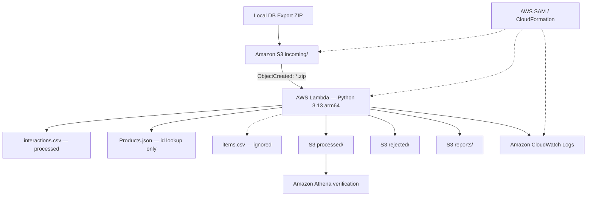

# Architecture

## Overview

This project is one small batch pipeline for e-commerce interactions. A local
database export is uploaded as a ZIP to S3. Lambda reads only
`interactions.csv` and the `id` lookup from `Products.json` directly from the
archive, validates every interaction, preserves the original IDs, and writes
clean, rejected, and report artifacts. `items.csv` is detected but ignored by
contract. Athena queries only the clean CSV; CloudWatch receives Lambda logs;
AWS SAM/CloudFormation owns the AWS resources.

## Component responsibilities

| Component | Responsibility |
|---|---|
| Archive reader | Enforce archive limits and safe member paths; find unique required basenames; read only the two required files. |
| Core pipeline | Normalize allowed fields, validate rows, remove exact duplicates, preserve order and original IDs. It has no AWS dependency. |
| Reporting | Produce equivalent JSON and readable Markdown quality evidence. |
| Local CLI | Call the core and write all artifacts below the selected `output/`. |
| Lambda adapter | Decode S3 events, check object size, call the same core, upload run-scoped and `latest` copies, and log summaries. |
| S3 | Store incoming archives and all generated artifacts using separate prefixes. |
| Athena | Query `processed/latest/interactions_clean.csv` without changing it. |
| CloudWatch | Retain concise Lambda execution logs for seven days. |
| SAM/CloudFormation | Create the bucket, Lambda, trigger, role/policies, log group, and stack outputs. |

## Data flow

1. The ZIP is checked for compressed size, member count, total uncompressed
   size, dangerous paths, missing basenames, and duplicate basenames.
2. `Products.json` is parsed and only `id` values are retained. Duplicate
   product IDs stop the job.
3. Headers in `interactions.csv` are matched after trimming and uppercasing.
4. `USER_ID` and `ITEM_ID` are read as strings and only edge whitespace is
   removed. No mapping, encoding, hashing, or surrogate IDs are created.
5. Valid rows are written in original relative order. Invalid rows go to the
   rejected CSV with pipe-separated reasons. A repeated normalized valid row is
   sent to rejected output as `DUPLICATE_ROW`.
6. Counts, timestamp range, ID audit, ignored files, and distributions become
   JSON and Markdown reports.

## Failure and rejected-data flow

Archive-level contract failures—invalid ZIP, unsafe member, missing required
file, ambiguous basename, size limit, malformed JSON, or duplicate product
ID—stop the complete job and Lambda raises an exception. CloudWatch records the
stack trace without logging datasets or credentials.

Row-level failures do not stop the job. They are written to
`interactions_rejected.csv` with one or more standard reasons. Clean rows remain
available for ML. The reports count both rejected rows and each reason.

## Security boundary

The bucket blocks all public access, enforces bucket-owner ownership, and uses
SSE-S3. Lambda uses the normal AWS SDK credential chain and receives only
`GetObject`/`GetObjectVersion` for `incoming/*`, `PutObject` for the three output
prefixes, and basic CloudWatch Logs permissions. No credentials are accepted by
the application or stored in this repository. The archive is never extracted,
so a ZIP entry cannot write to a filesystem path.

## Idempotency strategy

On AWS, `run_id` is SHA-256 of bucket, decoded object key, version ID (when
present), ETag, and object size. Redelivery of the same S3 event therefore
overwrites the same `run_id=<RUN_ID>/` artifacts instead of creating unlimited
folders. `latest/` is also overwritten. Local runs use the archive SHA-256, and
local paths are overwritten consistently.

## Deployment and cleanup flow

`sam validate --lint` checks the template. `sam build --no-use-container`
packages only `app/`; the local ZIP, output, tests, documentation, and SQL never
enter the Lambda package. `sam deploy` creates or updates one CloudFormation
stack. Cleanup first empties the generated S3 bucket and then uses `sam delete`;
the stack removes Lambda, its role, log group, and bucket.

