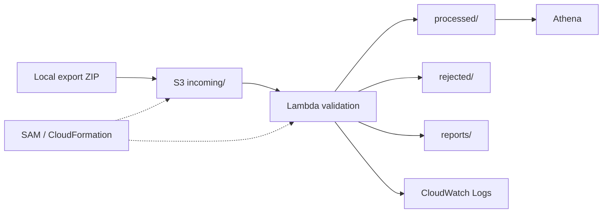

# Workshop: E-commerce Interaction Data Pipeline on AWS

## 1. Introduction

This workshop builds a small, readable batch pipeline that runs locally and is
deployable without Docker using Amazon S3, AWS Lambda, and Amazon Athena.

## 2. Problem Statement

The ML team needs a clean interaction CSV for recommendation training, while
each row must remain safely linkable to real users and products in the source
system.

## 3. Existing Data Problem

An earlier pipeline changed `user-001` and `prod-070` into codes such as
`U0001` and `P0042`. That dataset no longer matched the source safely. This
project creates no mapping, index, hash, UUID, or surrogate key.

## 4. Proposed Solution

Read the ZIP in memory, clean `interactions.csv`, use only the `id` field from
`Products.json` to validate `ITEM_ID`, preserve original IDs, and produce clean,
rejected, and two quality-report artifacts.

## 5. Project Scope

The project handles only batch interactions. It has no API, database, Docker,
Glue, Step Functions, multi-layer data lake, feature engineering, or ML model.

## 6. Data Source

The export ZIP may contain nested paths, so files are found by basename.
`interactions.csv` is processed; `Products.json` is an unchanged lookup;
`items.csv` is detected but ignored under the team data contract.

## 7. Data Contract

Input has four logical columns: `USER_ID`, `ITEM_ID`, `EVENT_TYPE`, and
`TIMESTAMP`. Header case and surrounding spaces may differ. Output always has
exactly these four columns in order, with no index or added feature.

## 8. Architecture

## 9. AWS Services Used

S3 stores inputs and outputs; Lambda runs the Python core; Athena verifies the
CSV; CloudWatch retains logs for seven days; SAM/CloudFormation manages the
resources; the IAM role can read `incoming/*` and write only output prefixes.

## 10. Local Processing Flow

The CLI checks its input, calls the core, creates directories below `output/`,
writes clean/rejected/JSON/Markdown files, and prints a short summary. The same
input overwrites the same paths and receives the same SHA-256 run ID.

## 11. AWS Processing Flow

S3 ObjectCreated triggers only for `incoming/*.zip`. Lambda URL-decodes the key,
checks size with `head_object`, downloads the ZIP, calls the shared core, and
writes both `run_id=<RUN_ID>/` and `latest/` copies. Multiple records are
supported.

## 12. Validation Rules

IDs must be non-empty; items must be in the lookup; events must be `view`,
`add_to_cart`, `remove_from_cart`, or `purchase`; timestamps must be positive
integer Unix seconds. Events are trimmed/lowercased; IDs are only edge-trimmed.

## 13. ID Preservation

`USER_ID` and `ITEM_ID` always remain strings. Case, hyphens, leading zeroes,
and original structure remain. The report proves output IDs are subsets of
input IDs, output items exist in Products, and generated ID counts are zero.

## 14. Rejected Data Handling

Invalid rows are written with normalized values and pipe-separated reasons. The
first valid exact duplicate is retained and later copies are rejected as
`DUPLICATE_ROW`. Archive-level contract failures stop the whole job.

## 15. Data Quality Report

JSON supports automation; Markdown supports reporting. Both include source,
times, run ID, row/missing counts, event/rejection distributions, timestamp
range, ID audit, unknown items, ignored files, and output list.

## 16. Infrastructure as Code

`template.yaml` creates a private SSE-S3 bucket, ZIP Lambda on Python 3.13 arm64,
filtered trigger, reserved concurrency 2, least-privilege role, seven-day log
group, and outputs. `CodeUri: app/` excludes local data.

## 17. Deployment

Verify a non-root AWS identity, run `sam validate --lint`,
`sam build --no-use-container`, and then `sam deploy --guided`. Docker is not
required. Deploy only after the user deliberately requests it and configures a
profile.

## 18. Amazon Athena Queries

SQL creates database `ecommerce_pipeline`, an external table over
`processed/latest/`, and checks totals, distributions, distinct IDs, top items,
daily activity, invalid rows, and 20 sample IDs. Athena never changes IDs.

## 19. CloudWatch Monitoring

Success logs include run ID, bucket/key, input/clean/rejected/duplicate counts,
unique users/items, status, and duration. The full dataset, full Products
content, and credentials are never logged.

## 20. Security

S3 uses Block Public Access, BucketOwnerEnforced ownership, and SSE-S3. Lambda
uses the AWS SDK credential chain; source code has no keys. No ZIP extraction
occurs, and traversal paths are rejected before required content is read.

## 21. Cost Control

Upload only for tests; keep concurrency low; create no NAT Gateway, EC2, RDS,
OpenSearch, or SageMaker; scan only the small CSV in Athena; retain logs seven
days. Empty the bucket and run `sam delete` after the workshop if unused.

## 22. Test Results

Local result on 2026-07-29: `48 passed in 0.14s`. Tests cover ID preservation,
validation, duplicates, ZIP traversal/limits, idempotency, Lambda filtering,
and multi-record handling.

## 23. Actual Data Results

The 155,323-byte `export.zip` produced 23,377 input/clean rows, zero rejected,
zero duplicates, 200 users, 100 items, and 100 product lookup IDs. Events:
17,089 view, 4,382 add_to_cart, 1,220 purchase, and 686 remove_from_cart. Time
ranges from 2026-05-21T01:59:47Z to 2026-07-19T23:58:44Z. ID audit is PASS and
both generated counts are zero.

## 24. Limitations

CSV and reports are held in Lambda memory, so defaults target small inputs (50
MiB ZIP, 150 MiB uncompressed, 100 members). `latest/` represents the most
recent successful write, not coordination across simultaneous sources.

## 25. Future Improvements

S3 Versioning, CloudWatch alarms, manifests/checksums, or a columnar format may
be added at larger scale. Any change must preserve real IDs and should be made
only when requirements exceed this workshop scope.

## 26. Conclusion

The new pipeline produces a four-column ML-ready dataset while retaining source
system linkage. Its current status is **Local verified / AWS deploy-ready**;
there is no claim of an actual AWS deployment or Athena execution yet.
