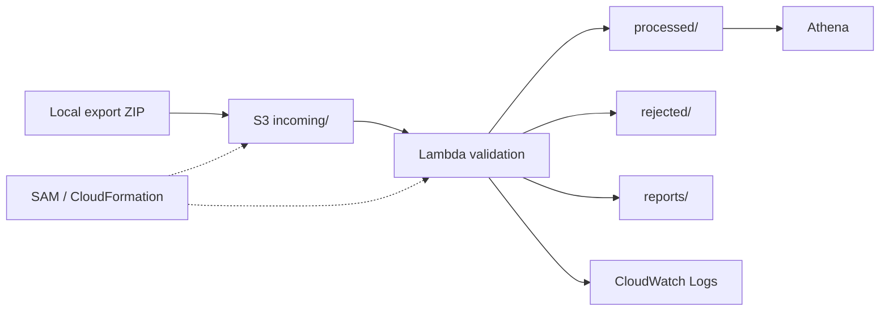

# Workshop: Pipeline dữ liệu interaction e-commerce trên AWS

## 1. Giới thiệu

Workshop xây dựng một batch pipeline nhỏ, dễ đọc, chạy local và sẵn sàng triển
khai không Docker bằng Amazon S3, AWS Lambda và Amazon Athena.

## 2. Bài toán

Đội ML cần một CSV interaction sạch để train recommendation model, nhưng dữ
liệu phải còn liên kết được với user và sản phẩm thật của hệ thống.

## 3. Vấn đề dữ liệu hiện có

Pipeline cũ từng đổi `user-001`, `prod-070` thành mã mới như `U0001`, `P0042`.
Dataset đó không còn khớp an toàn với hệ thống nguồn. Project mới tuyệt đối
không tạo mapping, index, hash, UUID hoặc surrogate key.

## 4. Giải pháp đề xuất

Đọc ZIP trong bộ nhớ, làm sạch `interactions.csv`, dùng duy nhất trường `id`
của `Products.json` để xác minh `ITEM_ID`, giữ nguyên ID và xuất clean,
rejected cùng hai quality report.

## 5. Phạm vi project

Project chỉ xử lý interaction batch. Không có API, database, Docker, Glue,
Step Functions, data lake nhiều tầng, feature engineering hoặc ML model.

## 6. Nguồn dữ liệu

ZIP export có thể lồng thư mục. File được tìm theo basename. `interactions.csv`
là dữ liệu xử lý; `Products.json` chỉ là lookup không bị sửa; `items.csv` được
nhận diện nhưng bỏ qua theo data contract.

## 7. Data contract

Input có bốn cột logic `USER_ID`, `ITEM_ID`, `EVENT_TYPE`, `TIMESTAMP`. Header
có thể khác hoa/thường và khoảng trắng. Output luôn đúng thứ tự bốn cột này,
không có index hoặc feature bổ sung.

## 8. Kiến trúc

## 9. Dịch vụ AWS sử dụng

S3 lưu input/output; Lambda chạy core Python; Athena xác minh CSV; CloudWatch
giữ log 7 ngày; SAM/CloudFormation quản lý tài nguyên; IAM role giới hạn quyền
đọc `incoming/*` và ghi ba prefix output.

## 10. Luồng xử lý local

CLI kiểm tra input, gọi core, tạo các thư mục dưới `output/`, ghi clean,
rejected, JSON/Markdown report rồi in summary ngắn. Cùng input ghi đè cùng vị
trí và có cùng run ID SHA-256.

## 11. Luồng xử lý AWS

S3 ObjectCreated chỉ trigger cho `incoming/*.zip`. Lambda URL-decode key, dùng
`head_object` kiểm tra size, tải ZIP, gọi core chung và ghi cả bản
`run_id=<RUN_ID>/` lẫn `latest/`. Nhiều Records được hỗ trợ.

## 12. Quy tắc validation

ID không được rỗng; item phải có trong lookup; event chỉ thuộc `view`,
`add_to_cart`, `remove_from_cart`, `purchase`; timestamp phải là Unix seconds
integer lớn hơn 0. Event được trim/lowercase; ID chỉ trim hai đầu.

## 13. Giữ nguyên ID

`USER_ID` và `ITEM_ID` luôn là string. Chữ hoa/thường, gạch nối, số 0 đầu và
cấu trúc gốc được giữ. Report chứng minh output ID là tập con input ID, item
output tồn tại trong Products và số ID sinh mới bằng 0.

## 14. Xử lý rejected data

Dòng sai được ghi cùng dữ liệu đã normalize và các lý do phân cách bởi `|`.
Exact duplicate hợp lệ đầu tiên được giữ; các bản sau vào rejected với
`DUPLICATE_ROW`. Lỗi contract cấp ZIP làm dừng cả job.

## 15. Data quality report

JSON dành cho tự động hóa; Markdown dành cho báo cáo. Cả hai chứa nguồn, thời
gian, run ID, row count, missing count, event/rejection distribution, timestamp
range, ID audit, item lạ, file bỏ qua và output list.

## 16. Infrastructure as Code

`template.yaml` tạo bucket private SSE-S3, Lambda Python 3.13 arm64 dạng ZIP,
trigger đã filter, reserved concurrency 2, role tối thiểu, log group 7 ngày và
CloudFormation Outputs. `CodeUri: app/` không package dữ liệu local.

## 17. Triển khai

Xác minh non-root AWS identity, chạy `sam validate --lint`,
`sam build --no-use-container`, rồi `sam deploy --guided`. Docker không bắt
buộc. Chỉ deploy khi người dùng chủ động yêu cầu và đã cấu hình profile.

## 18. Truy vấn Amazon Athena

SQL tạo database `ecommerce_pipeline`, external table trỏ tới
`processed/latest/`, rồi kiểm tra total, distribution, distinct IDs, top item,
event theo ngày, invalid rows và 20 ID mẫu. Athena không sửa ID.

## 19. Giám sát CloudWatch

Log thành công chứa run ID, bucket/key, input/clean/rejected/duplicate count,
unique user/item, status và duration. Dataset, Products đầy đủ và credential
không được log.

## 20. Bảo mật

S3 Block Public Access, BucketOwnerEnforced và SSE-S3. Lambda dùng AWS SDK
credential chain; source không chứa key. ZIP không extract nên path traversal bị
chặn trước khi đọc file cần thiết.

## 21. Kiểm soát chi phí

Chỉ upload khi test; concurrency nhỏ; không NAT Gateway, EC2, RDS, OpenSearch,
SageMaker; Athena chỉ scan CSV nhỏ; log giữ 7 ngày. Sau workshop, làm rỗng
bucket rồi `sam delete` nếu không còn dùng.

## 22. Kết quả test

Local ngày 29/07/2026: `48 passed in 0.14s`. Bộ test bao phủ giữ ID, validation,
duplicate, ZIP traversal/limits, idempotency và Lambda filter/multi-record.

## 23. Kết quả dữ liệu thật

`export.zip` 155.323 byte có 23.377 input/clean rows, 0 rejected, 0 duplicate,
200 user, 100 item và 100 lookup product. Event: view 17.089,
add_to_cart 4.382, purchase 1.220, remove_from_cart 686. Timestamp từ
2026-05-21T01:59:47Z đến 2026-07-19T23:58:44Z. ID audit PASS; generated counts
bằng 0.

## 24. Hạn chế

CSV và report được giữ trong bộ nhớ Lambda, nên giới hạn mặc định phù hợp file
nhỏ (ZIP 50 MiB, uncompressed 150 MiB, 100 members). `latest/` phản ánh lần ghi
thành công gần nhất, không phải cơ chế điều phối nhiều nguồn đồng thời.

## 25. Cải tiến tương lai

Có thể thêm S3 Versioning, cảnh báo CloudWatch, manifest/checksum hoặc chuyển
sang định dạng cột khi dữ liệu lớn. Các thay đổi phải tiếp tục giữ ID thật và
chỉ nên thêm khi nhu cầu vượt phạm vi workshop.

## 26. Kết luận

Pipeline mới tạo dataset ML-ready bốn cột mà vẫn duy trì liên kết với hệ thống
nguồn. Trạng thái hiện tại là **Local verified / AWS deploy-ready**; chưa có bằng
chứng deploy hoặc Athena query thật trên tài khoản AWS.
